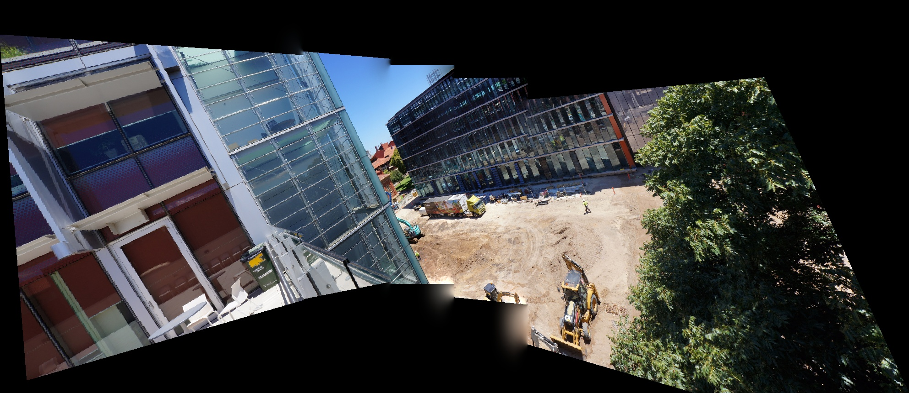

# ES 645 | 3D Computer Vision 

## Assignment 1:  Panorama Stitching

This Repository was created for the Panoroma Stitching coding assignment for my course 3D Computer Vision at IIT Gandhinagar. submitted by Varun Jain.

In this assignment, we try to implement the paper ["Automatic panoramic image stitching using invariant features"](https://link.springer.com/article/10.1007/s11263-006-0002-3) for stitching multiple images into one panormic image.

---

## Table of contents

- [Problem Statement](#problem-statement)
- [Background](#background)
- [Dataset](#dataset)
- [Technologies](#technologies)
- [Mathmatical Aspects](#mathematicalaspects)
  1. [Feature Detections](#1.-Common-Feature-Detection)
  2. [Homography](#2.-Calculating-Homography)
  3. [Warping](#3.-Warping-of-Images)
  4. [Blending](#4.-Blending-of-Images)
- [Setup](#setup)
- [Results](#results)
- [References](#references)

## Problem Statement

You must have come across the panorama mode in your smartphones for capturing wide-angle view of a physical scene. In this assignment, you will implement the same using the principles of feature matching, RANSAC, homography matrix, warping, and blending.

## Background

Image stitching is the process of combining multiple images of the same scene with over overlapping parts to produce a seamless panoramic or high-resolution image combining the field of view of all images. 

## Dataset

We were provided with 6 scenes each containing 5-6 images. The dataset can be viewed [here](/Images_Asgnmt3_1). 

## Technologies

The project uses Python >= 3.6

Other technologies used

- OpenCV
- NumPy

## Mathematical Aspects

### 1. Common Feature Detection

**Feature Extraction:** Is the process of extracting some feature that are distinguishible in the image. This process is done using ORB Feature Extractor. ORB is inbuilt in OpenCV and performs the task that is otherwise done using SIFT or SURF Feature Descriptors.

**Feature Matching:** Using Brute Force Matcher, similiar features that are extracted using the feature extractor are matched. This gives us pair of cordinates of similar features, corresponding to each image. 

The code can be found [here](/FeatureMatching.py$L6).

### 2. Calculating Homography

**RANSAC:** To calculate an approximate homography between the images, we perform Random Sampling Consesus (RANSAC). This algorithm calculates the homography based on randomly chosen features and then takes a consensus based on the inliers of the homography. Finally the best homography is the one that has the most inliers.

The code can be found [here](/Homography_Ransac.py#L31).

### 3. Warping of Images

The images are transformed/warped according to the calculated homography matrix.

The code can be found [here](/mywarp.py#L10).

### 4. Blending of Images

We blend the images using Image Pyramids. This is done using stacking of Laplacian Pyramids and finally reconstructing the image from these pyramids.

The code can be found [here](/mywarp.py#L67).

## Setup

One can simply install the requirements for the program using ```pip install -r requirements.txt```

The main fail is [mywrap.py](/mywrap.py).
One can change the ```IMG_DIR``` in the main function as per there convenience.

NOTE: Sometimes RANSAC can misbehave for certain scenes, one can change number of iterations for RANSAC by increasing ```max_iterations``` in the following [line](/Homography_Ransac.py#L31).

## Results

Here are the results on the 6 scenes provided in our dataset. 

For each scenerios, all the photos are taken for calculating the panorama.

We observe that the best results are obtained in **Scene-2** and **Scene-5**.

### Scene 1

Number of pictures: 6

**Using Inbuilt homography:**

<p align="center">
  
</p>

**Using Ransac homograpy:**
<p align="center">
  
</p>

### Scene 2
Number of pictures: 5

**Using Inbuilt homography:**

<p align="center">
  
</p>

**Using Ransac homograpy:**
<p align="center">
  
</p>

### Scene 3
Number of pictures: 5

**Using Inbuilt homography:**

<p align="center">
  
</p>

**Using Ransac homograpy:**
<p align="center">
  
</p>

### Scene 4
Number of pictures: 5

**Using Inbuilt homography:**

<p align="center">
  
</p>

**Using Ransac homograpy:**
<p align="center">
  
</p>

### Scene 5
Number of pictures: 5

**Using Inbuilt homography:**

<p align="center">
  
</p>

**Using Ransac homograpy:**
<p align="center">
  
</p>

### Scene 6
Number of pictures: 5

**Using Inbuilt homography:**

<p align="center">
  
</p>

**Using Ransac homograpy:**
<p align="center">
  
</p>